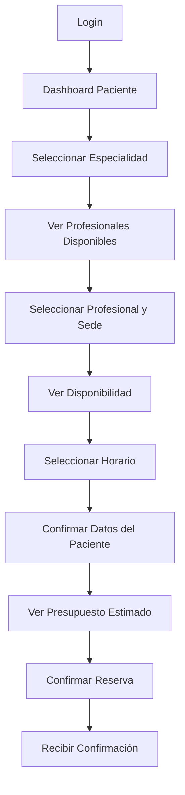
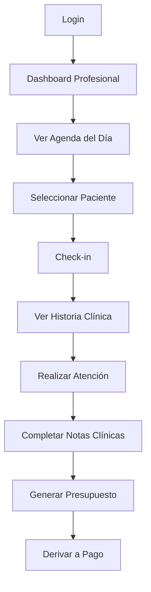
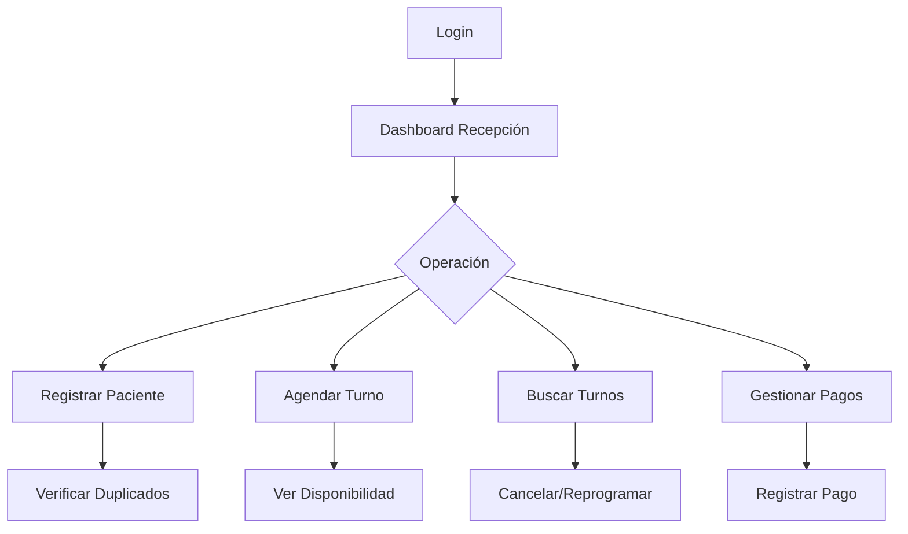

# Documento Funcional - Frontend React
## Sistema de Reserva de Citas Médicas - Centro Odontológico (OdontoAgenda)

---

## Índice

1. [Introducción](#1-introducción)
2. [Arquitectura del Sistema](#2-arquitectura-del-sistema)
3. [Servicios y Endpoints](#3-servicios-y-endpoints)
4. [Guía de Implementación en React](#4-guía-de-implementación-en-react)
5. [Estructura de Carpetas Recomendada](#5-estructura-de-carpetas-recomendada)
6. [Configuración del Proyecto](#6-configuración-del-proyecto)
7. [Módulos Funcionales](#7-módulos-funcionales)
8. [Flujos de Usuario](#8-flujos-de-usuario)
9. [Consideraciones de Seguridad](#9-consideraciones-de-seguridad)
10. [Anexos: Especificación Completa de APIs](#10-anexos-especificación-completa-de-apis)

---

## 1. Introducción

Este documento describe los requerimientos funcionales y técnicos para desarrollar el frontend en **React** del sistema **OdontoAgenda**, una plataforma integral de reservas odontológicas multi-especialidad y multi-sucursal.

### 1.1 Propósito

Proveer una guía completa para el equipo de desarrollo frontend, detallando:
- La estructura de servicios backend disponibles
- Los endpoints HTTP con sus request/response
- Los flujos de usuario por rol
- La arquitectura recomendada para la aplicación React

### 1.2 Alcance

El sistema cubre los siguientes dominios (Bounded Contexts):
- **IAM**: Gestión de identidad y acceso
- **Patient**: Administración de pacientes
- **Professional**: Gestión de profesionales
- **Scheduling**: Reservas y agenda
- **Billing**: Facturación y pagos
- **Coverage**: Convenios y prepagas
- **Notifications**: Notificaciones (event-driven)

---

## 2. Arquitectura del Sistema

### 2.1 Stack Tecnológico Backend

| Componente | Tecnología |
|------------|-----------|
| Lenguaje | Go 1.23 |
| Base de Datos | PostgreSQL 16 + PostGIS |
| Mensajería | NATS JetStream |
| Arquitectura | DDD + Hexagonal |
| Autenticación | JWT (HMAC-SHA256) |

### 2.2 Servicios y Puertos

| Servicio | Puerto | Descripción |
|----------|--------|-------------|
| IAM | 8081 | Registro, login, tokens |
| Patient | 8082 | Pacientes, coberturas, alertas |
| Professional | 8083 | Profesionales, matrículas, agenda |
| Scheduling | 8084 | Reservas, disponibilidad |
| Coverage | 8085 | Convenios y prepagas |
| Notifications | 8086 | Recordatorios y confirmaciones |
| Billing | 8087 | Pagos y facturación |

### 2.3 Patrón de Comunicación

- **Comunicación síncrona**: HTTP REST entre frontend y backend
- **Comunicación asíncrona**: Domain Events vía NATS JetStream (entre servicios backend)
- **Autenticación**: JWT Bearer Token en header `Authorization`

---

## 3. Servicios y Endpoints

### 3.1 IAM (Identity & Access Management) - Puerto 8081

#### Autenticación y Autorización

| Método | Endpoint | Descripción | Auth |
|--------|----------|-------------|------|
| POST | `/auth/register` | Registro de usuario | No |
| POST | `/auth/login` | Login y obtención de tokens | No |
| POST | `/auth/refresh` | Refrescar tokens | No |
| POST | `/auth/logout` | Cerrar sesión | Sí |
| GET | `/auth/me` | Obtener datos del usuario actual | Sí |

#### Request/Response Ejemplos

**POST /auth/register**
```json
// Request
{
  "email": "juan.perez@email.com",
  "password": "SecurePass123!",
  "role": "patient",
  "family_name": "Familia Pérez"
}

// Response 201
{
  "user_id": "550e8400-e29b-41d4-a716-446655440000",
  "family_id": "660e8400-e29b-41d4-a716-446655440001"
}
```

**POST /auth/login**
```json
// Request
{
  "email": "juan.perez@email.com",
  "password": "SecurePass123!",
  "device_id": "chrome-windows-uuid"
}

// Response 200
{
  "access_token": "eyJhbGciOiJIUzI1NiIs...",
  "refresh_token": "eyJhbGciOiJIUzI1NiIs...",
  "access_token_expiry": 1735689600,
  "refresh_token_expiry": 1738281600,
  "token_type": "Bearer"
}
```

**GET /auth/me**
```json
// Response 200
{
  "user_id": "550e8400-e29b-41d4-a716-446655440000",
  "role": "patient",
  "patient_id": "770e8400-e29b-41d4-a716-446655440002",
  "family_id": "660e8400-e29b-41d4-a716-446655440001",
  "is_guardian": true,
  "clinic_ids": []
}
```

---

### 3.2 Patient Management - Puerto 8082

#### Gestión de Pacientes

| Método | Endpoint | Descripción | Roles Permitidos |
|--------|----------|-------------|------------------|
| POST | `/patients` | Registrar paciente | Todos autenticados |
| GET | `/patients` | Buscar pacientes | Todos autenticados |
| GET | `/patients/{id}` | Obtener detalle | Todos autenticados |
| GET | `/patients/{id}/for-booking` | Datos para reserva | Todos autenticados |
| POST | `/patients/{id}/coverage` | Agregar cobertura | Staff |
| POST | `/patients/{id}/medical-alerts` | Agregar alerta médica | Staff o propio paciente |
| POST | `/patients/merge` | Fusionar pacientes duplicados | Admin |

#### Request/Response Ejemplos

**POST /patients**
```json
// Request
{
  "full_name": "María González",
  "birth_date": "1990-05-15",
  "gender": "female",
  "doc_type": "DNI",
  "doc_number": "12345678",
  "phone": "+5491112345678",
  "email": "maria@email.com",
  "emergency_name": "Juan González",
  "emergency_phone": "+5491187654321",
  "skip_duplicate_check": false
}

// Response 201 (éxito)
{
  "patient_id": "880e8400-e29b-41d4-a716-446655440003"
}

// Response 409 (posibles duplicados)
{
  "code": "DUPLICATE_WARNING",
  "message": "Se encontraron pacientes similares. Confirme con skip_duplicate_check=true para continuar.",
  "candidates": [
    {
      "patient_id": "880e8400-e29b-41d4-a716-446655440099",
      "full_name": "Maria Gonzalez",
      "score": 0.95,
      "matched_on": ["doc_number", "birth_date"]
    }
  ]
}
```

**GET /patients?q=maria&limit=10&offset=0**
```json
// Response 200
{
  "items": [
    {
      "patient_id": "880e8400-e29b-41d4-a716-446655440003",
      "full_name": "María González",
      "birth_date": "1990-05-15",
      "doc_number": "12345678",
      "phone": "+5491112345678"
    }
  ],
  "total": 1,
  "limit": 10,
  "offset": 0
}
```

**POST /patients/{id}/coverage**
```json
// Request
{
  "coverage_type": "prepaga",
  "agreement_id": "990e8400-e29b-41d4-a716-446655440004",
  "provider_name": "OSDE",
  "plan_code": "OSDE-210",
  "membership_number": "123456789",
  "valid_from": "2024-01-01",
  "valid_until": "2024-12-31",
  "co_pay_percent": 20,
  "co_pay_fixed_cents": 5000
}

// Response 201
{
  "coverage_id": "aa0e8400-e29b-41d4-a716-446655440005"
}
```

---

### 3.3 Professional Management - Puerto 8083

#### Gestión de Profesionales

| Método | Endpoint | Descripción | Roles Permitidos |
|--------|----------|-------------|------------------|
| POST | `/professionals` | Registrar profesional | Admin |
| GET | `/professionals` | Listar profesionales | Todos autenticados |
| GET | `/professionals/{id}` | Obtener detalle | Todos autenticados |
| GET | `/professionals/{id}/for-scheduling` | Datos para agenda | Staff |
| POST | `/professionals/{id}/licenses` | Agregar matrícula | Admin |
| POST | `/professionals/{id}/clinics` | Asignar a sede | Admin |
| PATCH | `/professionals/{id}/schedule` | Actualizar horario | Admin |
| POST | `/professionals/{id}/exceptions` | Agregar excepción | Admin |
| POST | `/professionals/durations` | Setear duración procedimiento | Admin |
| POST | `/professionals/{id}/suspend` | Suspender profesional | Admin |

#### Request/Response Ejemplos

**POST /professionals**
```json
// Request
{
  "full_name": "Dr. Martín Rodríguez",
  "doc_type": "DNI",
  "doc_number": "87654321",
  "email": "martin.rodriguez@odontologia.com",
  "phone": "+5491198765432",
  "bio": "Especialista en ortodoncia con 10 años de experiencia"
}

// Response 201
{
  "professional_id": "bb0e8400-e29b-41d4-a716-446655440006"
}
```

**POST /professionals/{id}/licenses**
```json
// Request
{
  "specialty_code": "ORTO",
  "specialty_name": "Ortodoncia",
  "license_number": "MAT-12345",
  "issuing_body": "Colegio de Odontólogos de CABA",
  "issued_at": "2020-01-15",
  "expires_at": "2025-01-15",
  "document_ref": "s3://docs/licenses/mat-12345.pdf"
}

// Response 201
{
  "license_id": "cc0e8400-e29b-41d4-a716-446655440007"
}
```

**POST /professionals/{id}/clinics**
```json
// Request
{
  "clinic_id": "dd0e8400-e29b-41d4-a716-446655440008",
  "specialties": ["ORTO", "IMPL"],
  "weekly_schedule": [
    {"weekday": 1, "start_hour": 9, "start_min": 0, "end_hour": 13, "end_min": 0},
    {"weekday": 3, "start_hour": 15, "start_min": 0, "end_hour": 20, "end_min": 0}
  ],
  "assigned_from": "2024-01-01"
}

// Response 201
{
  "assignment_id": "ee0e8400-e29b-41d4-a716-446655440009"
}
```

---

### 3.4 Scheduling - Puerto 8084

#### Gestión de Reservas

| Método | Endpoint | Descripción | Roles Permitidos |
|--------|----------|-------------|------------------|
| GET | `/scheduling/availability` | Disponibilidad día específico | Todos autenticados |
| GET | `/scheduling/availability/range` | Disponibilidad rango de fechas | Todos autenticados |
| GET | `/scheduling/day-schedule` | Vista diaria de agenda | Staff |
| GET | `/scheduling/patients/{id}/appointments` | Citas del paciente | Todos autenticados |
| POST | `/scheduling/appointments` | Reservar cita | Todos autenticados |
| POST | `/scheduling/appointments/{id}/cancel` | Cancelar cita | Todos autenticados |
| POST | `/scheduling/appointments/{id}/check-in` | Check-in | Staff |
| POST | `/scheduling/appointments/{id}/complete` | Completar cita | Profesional/Admin |
| POST | `/scheduling/appointments/{id}/no-show` | Marcar no presentado | Staff/Admin |
| POST | `/scheduling/block-slot` | Bloquear horario | Staff/Admin |

#### Request/Response Ejemplos

**GET /scheduling/availability?professional_id=xxx&clinic_id=yyy&date=2024-01-15&procedure_code=LIMPIEZA**
```json
// Response 200
{
  "date": "2024-01-15",
  "slots": [
    {
      "start": "2024-01-15T09:00:00Z",
      "end": "2024-01-15T09:45:00Z",
      "available": true
    },
    {
      "start": "2024-01-15T09:45:00Z",
      "end": "2024-01-15T10:30:00Z",
      "available": false,
      "reason": "already_booked"
    }
  ]
}
```

**POST /scheduling/appointments**
```json
// Request
{
  "patient_id": "880e8400-e29b-41d4-a716-446655440003",
  "booked_by_id": "550e8400-e29b-41d4-a716-446655440000",
  "professional_id": "bb0e8400-e29b-41d4-a716-446655440006",
  "clinic_id": "dd0e8400-e29b-41d4-a716-446655440008",
  "procedure_code": "LIMPIEZA",
  "slot_start": "2024-01-15T09:00:00Z",
  "slot_end": "2024-01-15T09:45:00Z",
  "coverage_type": "prepaga",
  "agreement_id": "990e8400-e29b-41d4-a716-446655440004",
  "requires_authorization": false
}

// Response 201
{
  "appointment_id": "ff0e8400-e29b-41d4-a716-446655440010",
  "status": "confirmed"
}
```

**POST /scheduling/appointments/{id}/cancel**
```json
// Request
{
  "reason": "El paciente solicitó reprogramar",
  "note": "Llamar para reagendar la próxima semana"
}

// Response 204 (No Content)
```

---

### 3.5 Billing - Puerto 8087

#### Facturación y Pagos

| Método | Endpoint | Descripción | Roles Permitidos |
|--------|----------|-------------|------------------|
| GET | `/billing/quotes/{id}` | Obtener presupuesto | Todos autenticados |
| GET | `/billing/appointments/{id}/quote` | Presupuesto por cita | Todos autenticados |
| GET | `/billing/patients/{id}/account` | Estado de cuenta | Todos autenticados |
| GET | `/billing/patients/{id}/quotes` | Historial presupuestos | Todos autenticados |
| POST | `/billing/quotes/{id}/payments` | Registrar pago | Staff/Admin |
| POST | `/billing/quotes/{id}/payments/mercadopago` | Iniciar pago MP | Todos autenticados |
| POST | `/billing/quotes/{id}/void` | Anular presupuesto | Admin |
| POST | `/billing/quotes/{id}/refund` | Reembolsar | Admin |
| PUT | `/billing/late-fees/{id}/waive` | Eximir cargo moratorio | Admin |
| GET | `/billing/reports/daily` | Reporte diario | Admin |
| GET | `/billing/reports/clinic` | Reporte por clínica | Admin |
| POST | `/billing/webhooks/mercadopago` | Webhook MP | No (HMAC) |

#### Request/Response Ejemplos

**GET /billing/appointments/{id}/quote**
```json
// Response 200
{
  "quote_id": "gg0e8400-e29b-41d4-a716-446655440011",
  "appointment_id": "ff0e8400-e29b-41d4-a716-446655440010",
  "procedure": {
    "code": "LIMPIEZA",
    "name": "Limpieza Dental Completa",
    "base_price_cents": 2500000
  },
  "coverage": {
    "type": "prepaga",
    "provider": "OSDE",
    "plan": "OSDE-210",
    "coverage_percent": 80,
    "co_pay_percent": 20,
    "co_pay_fixed_cents": 5000
  },
  "totals": {
    "subtotal_cents": 2500000,
    "discount_cents": 2000000,
    "co_pay_cents": 505000,
    "total_cents": 505000
  },
  "status": "pending"
}
```

**POST /billing/quotes/{id}/payments**
```json
// Request
{
  "amount_cents": 505000,
  "payment_method": "cash",
  "notes": "Pago en efectivo"
}

// Response 201
{
  "payment_id": "hh0e8400-e29b-41d4-a716-446655440012",
  "status": "completed"
}
```

---

### 3.6 Coverage - Puerto 8085

#### Convenios y Autorizaciones

| Método | Endpoint | Descripción | Roles Permitidos |
|--------|----------|-------------|------------------|
| POST | `/agreements` | Crear convenio | Admin |
| GET | `/agreements` | Listar convenios | Staff/Admin |
| GET | `/agreements/{id}` | Detalle convenio | Staff/Admin |
| PATCH | `/agreements/{id}/status` | Cambiar estado | SuperAdmin |
| POST | `/agreements/{id}/plans` | Agregar plan | Admin |
| PUT | `/agreements/{id}/plans/{id}/procedures` | Configurar prestación | Admin |
| GET | `/coverage/calculate` | Calcular cobertura | Todos autenticados |
| GET | `/coverage/verify-affiliation` | Verificar afiliación | Todos autenticados |
| POST | `/authorizations` | Solicitar autorización | Staff |
| GET | `/authorizations/pending` | Autorizaciones pendientes | Admin |
| GET | `/authorizations/{id}` | Detalle autorización | Staff/Admin |
| PATCH | `/authorizations/{id}/resolve` | Resolver autorización | Admin |

---

## 4. Guía de Implementación en React

### 4.1 Tecnologías Recomendadas

| Categoría | Tecnología | Versión |
|-----------|-----------|---------|
| Framework | React | 18.x |
| Language | TypeScript | 5.x |
| Build Tool | Vite | 5.x |
| State Management | Zustand o Redux Toolkit | 4.x |
| Routing | React Router | 6.x |
| HTTP Client | Axios o TanStack Query | 1.x / 5.x |
| UI Library | Material UI o Ant Design | 5.x |
| Forms | React Hook Form | 7.x |
| Validation | Zod | 3.x |
| Date Handling | date-fns o Day.js | 2.x |
| Testing | Vitest + React Testing Library | 2.x |

### 4.2 Configuración Inicial

```bash
# Crear proyecto con Vite
npm create vite@latest odontoagenda-frontend -- --template react-ts

# Instalar dependencias principales
cd odontoagenda-frontend
npm install

# Instalar librerías recomendadas
npm install react-router-dom axios @tanstack/react-query zustand
npm install @mui/material @mui/icons-material @emotion/react @emotion/styled
npm install react-hook-form zod @hookform/resolvers
npm install date-fns
npm install vitest @testing-library/react @testing-library/jest-dom --save-dev
```

### 4.3 Variables de Entorno

Crear archivo `.env`:

```env
VITE_API_BASE_URL_IAM=http://localhost:8081
VITE_API_BASE_URL_PATIENT=http://localhost:8082
VITE_API_BASE_URL_PROFESSIONAL=http://localhost:8083
VITE_API_BASE_URL_SCHEDULING=http://localhost:8084
VITE_API_BASE_URL_COVERAGE=http://localhost:8085
VITE_API_BASE_URL_BILLING=http://localhost:8087
VITE_APP_NAME=OdontoAgenda
```

---

## 5. Estructura de Carpetas Recomendada

```
odontoagenda-frontend/
├── public/
│   └── favicon.ico
├── src/
│   ├── api/                    # Clientes HTTP por servicio
│   │   ├── iam.api.ts
│   │   ├── patient.api.ts
│   │   ├── professional.api.ts
│   │   ├── scheduling.api.ts
│   │   ├── billing.api.ts
│   │   ├── coverage.api.ts
│   │   └── api.client.ts       # Config base de axios
│   │
│   ├── components/             # Componentes reutilizables
│   │   ├── common/
│   │   │   ├── Button.tsx
│   │   │   ├── Input.tsx
│   │   │   ├── Modal.tsx
│   │   │   ├── Table.tsx
│   │   │   └── Loading.tsx
│   │   ├── layout/
│   │   │   ├── Header.tsx
│   │   │   ├── Sidebar.tsx
│   │   │   └── Footer.tsx
│   │   └── forms/
│   │       ├── PatientForm.tsx
│   │       ├── AppointmentForm.tsx
│   │       └── PaymentForm.tsx
│   │
│   ├── hooks/                  # Custom hooks
│   │   ├── useAuth.ts
│   │   ├── usePatients.ts
│   │   ├── useAppointments.ts
│   │   └── usePermissions.ts
│   │
│   ├── pages/                  # Vistas principales
│   │   ├── auth/
│   │   │   ├── Login.tsx
│   │   │   ├── Register.tsx
│   │   │   └── ForgotPassword.tsx
│   │   ├── dashboard/
│   │   │   ├── Dashboard.tsx
│   │   │   └── Stats.tsx
│   │   ├── patients/
│   │   │   ├── PatientList.tsx
│   │   │   ├── PatientDetail.tsx
│   │   │   └── PatientForm.tsx
│   │   ├── appointments/
│   │   │   ├── AppointmentCalendar.tsx
│   │   │   ├── AppointmentList.tsx
│   │   │   └── AppointmentBooking.tsx
│   │   ├── professionals/
│   │   │   ├── ProfessionalList.tsx
│   │   │   └── ProfessionalForm.tsx
│   │   ├── billing/
│   │   │   ├── QuoteList.tsx
│   │   │   ├── PaymentForm.tsx
│   │   │   └── Reports.tsx
│   │   └── settings/
│   │       ├── Profile.tsx
│   │       └── Configuration.tsx
│   │
│   ├── store/                  # Estado global (Zustand)
│   │   ├── auth.store.ts
│   │   ├── patient.store.ts
│   │   └── appointment.store.ts
│   │
│   ├── types/                  # Tipos TypeScript
│   │   ├── user.types.ts
│   │   ├── patient.types.ts
│   │   ├── appointment.types.ts
│   │   ├── billing.types.ts
│   │   └── api.types.ts
│   │
│   ├── utils/                  # Utilidades
│   │   ├── formatters.ts
│   │   ├── validators.ts
│   │   └── constants.ts
│   │
│   ├── routes/                 # Configuración de rutas
│   │   ├── index.tsx
│   │   ├── protected.routes.tsx
│   │   └── public.routes.tsx
│   │
│   ├── App.tsx
│   ├── main.tsx
│   └── vite-env.d.ts
│
├── .env
├── .env.example
├── package.json
├── tsconfig.json
├── vite.config.ts
└── README.md
```

---

## 6. Configuración del Proyecto

### 6.1 Cliente HTTP Base (`src/api/api.client.ts`)

```typescript
import axios, { AxiosInstance, AxiosError, InternalAxiosRequestConfig } from 'axios';

const API_BASE_URLS = {
  IAM: import.meta.env.VITE_API_BASE_URL_IAM,
  PATIENT: import.meta.env.VITE_API_BASE_URL_PATIENT,
  PROFESSIONAL: import.meta.env.VITE_API_BASE_URL_PROFESSIONAL,
  SCHEDULING: import.meta.env.VITE_API_BASE_URL_SCHEDULING,
  COVERAGE: import.meta.env.VITE_API_BASE_URL_COVERAGE,
  BILLING: import.meta.env.VITE_API_BASE_URL_BILLING,
};

class ApiClient {
  private instances: Map<string, AxiosInstance>;

  constructor() {
    this.instances = new Map();
    this.initializeInstances();
  }

  private initializeInstances(): void {
    Object.entries(API_BASE_URLS).forEach(([key, baseURL]) => {
      const instance = axios.create({
        baseURL,
        timeout: 30000,
        headers: {
          'Content-Type': 'application/json',
        },
      });

      // Interceptor para agregar token
      instance.interceptors.request.use(
        (config: InternalAxiosRequestConfig) => {
          const token = localStorage.getItem('access_token');
          if (token && config.headers) {
            config.headers.Authorization = `Bearer ${token}`;
          }
          return config;
        },
        (error) => Promise.reject(error)
      );

      // Interceptor para manejar errores
      instance.interceptors.response.use(
        (response) => response,
        async (error: AxiosError) => {
          if (error.response?.status === 401) {
            // Intentar refrescar token
            const refreshed = await this.refreshToken();
            if (refreshed) {
              return instance.request(error.config!);
            }
            // Logout forzado
            localStorage.removeItem('access_token');
            localStorage.removeItem('refresh_token');
            window.location.href = '/login';
          }
          return Promise.reject(error);
        }
      );

      this.instances.set(key, instance);
    });
  }

  private async refreshToken(): Promise<boolean> {
    const refreshToken = localStorage.getItem('refresh_token');
    const userId = localStorage.getItem('user_id');

    if (!refreshToken || !userId) return false;

    try {
      const response = await axios.post(`${API_BASE_URLS.IAM}/auth/refresh`, {
        refresh_token: refreshToken,
        user_id: userId,
        device_id: navigator.userAgent,
      });

      const { access_token, refresh_token } = response.data;
      localStorage.setItem('access_token', access_token);
      localStorage.setItem('refresh_token', refresh_token);
      return true;
    } catch {
      return false;
    }
  }

  getInstance(service: keyof typeof API_BASE_URLS): AxiosInstance {
    const instance = this.instances.get(service);
    if (!instance) {
      throw new Error(`Service ${service} not found`);
    }
    return instance;
  }
}

export const apiClient = new ApiClient();
export { API_BASE_URLS };
```

### 6.2 Tipos TypeScript (`src/types/`)

**user.types.ts**
```typescript
export type UserRole =
  | 'super_admin'
  | 'clinic_admin'
  | 'professional'
  | 'receptionist'
  | 'patient';

export interface User {
  user_id: string;
  role: UserRole;
  patient_id?: string;
  family_id?: string;
  is_guardian: boolean;
  clinic_ids?: string[];
}

export interface AuthTokens {
  access_token: string;
  refresh_token: string;
  access_token_expiry: number;
  refresh_token_expiry: number;
  token_type: string;
}

export interface LoginCredentials {
  email: string;
  password: string;
  device_id?: string;
}

export interface RegisterData {
  email: string;
  password: string;
  role: string;
  family_name?: string;
}
```

**patient.types.ts**
```typescript
export interface Patient {
  patient_id: string;
  full_name: string;
  birth_date: string;
  gender: string;
  doc_type: string;
  doc_number: string;
  phone: string;
  email?: string;
  emergency_name?: string;
  emergency_phone?: string;
  created_at: string;
  updated_at: string;
}

export interface Coverage {
  coverage_id: string;
  coverage_type: string;
  provider_name: string;
  plan_code: string;
  membership_number: string;
  valid_from: string;
  valid_until?: string;
  co_pay_percent?: number;
  co_pay_fixed_cents?: number;
}

export interface MedicalAlert {
  alert_id: string;
  alert_type: string;
  severity?: string;
  description: string;
  is_self_reported: boolean;
  created_at: string;
}

export interface DuplicateCandidate {
  patient_id: string;
  full_name: string;
  score: number;
  matched_on: string[];
}
```

**appointment.types.ts**
```typescript
export type AppointmentStatus =
  | 'scheduled'
  | 'confirmed'
  | 'checked_in'
  | 'completed'
  | 'cancelled'
  | 'no_show';

export interface Appointment {
  appointment_id: string;
  patient_id: string;
  patient_name: string;
  professional_id: string;
  professional_name: string;
  clinic_id: string;
  procedure_code: string;
  procedure_name: string;
  slot_start: string;
  slot_end: string;
  status: AppointmentStatus;
  coverage_type?: string;
  created_at: string;
}

export interface TimeSlot {
  start: string;
  end: string;
  available: boolean;
  reason?: string;
}

export interface AvailabilityQuery {
  professional_id: string;
  clinic_id: string;
  date: string;
  procedure_code?: string;
}
```

### 6.3 Servicios API (`src/api/`)

**iam.api.ts**
```typescript
import { apiClient } from './api.client';
import type { User, AuthTokens, LoginCredentials, RegisterData } from '../types/user.types';

export const iamApi = {
  register: async (data: RegisterData) => {
    const response = await apiClient.getInstance('IAM').post('/auth/register', data);
    return response.data;
  },

  login: async (credentials: LoginCredentials) => {
    const response = await apiClient.getInstance('IAM').post('/auth/login', {
      ...credentials,
      device_id: credentials.device_id || navigator.userAgent,
    });
    return response.data;
  },

  refreshToken: async (refreshToken: string, userId: string) => {
    const response = await apiClient.getInstance('IAM').post('/auth/refresh', {
      refresh_token: refreshToken,
      user_id: userId,
      device_id: navigator.userAgent,
    });
    return response.data;
  },

  logout: async (options?: { refresh_token?: string; global_logout?: boolean }) => {
    await apiClient.getInstance('IAM').post('/auth/logout', options);
  },

  getCurrentUser: async (): Promise<User> => {
    const response = await apiClient.getInstance('IAM').get('/auth/me');
    return response.data;
  },
};
```

**patient.api.ts**
```typescript
import { apiClient } from './api.client';
import type { Patient, Coverage, MedicalAlert, DuplicateCandidate } from '../types/patient.types';

interface RegisterPatientCommand {
  full_name: string;
  birth_date: string;
  gender: string;
  doc_type: string;
  doc_number: string;
  phone: string;
  email?: string;
  emergency_name?: string;
  emergency_phone?: string;
  skip_duplicate_check?: boolean;
}

interface SearchParams {
  q?: string;
  limit?: number;
  offset?: number;
}

export const patientApi = {
  register: async (data: RegisterPatientCommand) => {
    const response = await apiClient.getInstance('PATIENT').post('/patients', data);
    return response.data;
  },

  search: async (params: SearchParams) => {
    const response = await apiClient.getInstance('PATIENT').get('/patients', { params });
    return response.data;
  },

  getById: async (patientId: string): Promise<Patient> => {
    const response = await apiClient.getInstance('PATIENT').get(`/patients/${patientId}`);
    return response.data;
  },

  getForBooking: async (patientId: string) => {
    const response = await apiClient.getInstance('PATIENT').get(`/patients/${patientId}/for-booking`);
    return response.data;
  },

  addCoverage: async (patientId: string, coverage: Partial<Coverage>) => {
    const response = await apiClient.getInstance('PATIENT').post(
      `/patients/${patientId}/coverage`,
      coverage
    );
    return response.data;
  },

  addMedicalAlert: async (patientId: string, alert: { alert_type: string; severity?: string; description: string }) => {
    const response = await apiClient.getInstance('PATIENT').post(
      `/patients/${patientId}/medical-alerts`,
      alert
    );
    return response.data;
  },

  mergePatients: async (targetPatientId: string, sourcePatientId: string) => {
    await apiClient.getInstance('PATIENT').post('/patients/merge', {
      target_patient_id: targetPatientId,
      source_patient_id: sourcePatientId,
    });
  },
};
```

**scheduling.api.ts**
```typescript
import { apiClient } from './api.client';
import type { Appointment, TimeSlot, AvailabilityQuery } from '../types/appointment.types';

interface BookAppointmentCommand {
  patient_id: string;
  booked_by_id?: string;
  professional_id: string;
  clinic_id: string;
  procedure_code: string;
  slot_start: string;
  slot_end: string;
  coverage_type?: string;
  agreement_id?: string;
  requires_authorization?: boolean;
}

interface CancelAppointmentCommand {
  reason: string;
  note?: string;
}

export const schedulingApi = {
  getAvailability: async (query: AvailabilityQuery): Promise<{ slots: TimeSlot[] }> => {
    const response = await apiClient.getInstance('SCHEDULING').get('/scheduling/availability', {
      params: query,
    });
    return response.data;
  },

  getAvailabilityRange: async (params: {
    professional_id?: string;
    clinic_id?: string;
    from: string;
    to: string;
    procedure_code?: string;
  }) => {
    const response = await apiClient.getInstance('SCHEDULING').get('/scheduling/availability/range', {
      params,
    });
    return response.data;
  },

  getDaySchedule: async (params: { professional_id?: string; clinic_id?: string; date?: string }) => {
    const response = await apiClient.getInstance('SCHEDULING').get('/scheduling/day-schedule', {
      params,
    });
    return response.data;
  },

  getPatientAppointments: async (patientId: string, onlyActive?: boolean) => {
    const response = await apiClient.getInstance('SCHEDULING').get(
      `/scheduling/patients/${patientId}/appointments`,
      { params: { only_active: onlyActive } }
    );
    return response.data;
  },

  bookAppointment: async (data: BookAppointmentCommand) => {
    const response = await apiClient.getInstance('SCHEDULING').post('/scheduling/appointments', data);
    return response.data;
  },

  cancelAppointment: async (appointmentId: string, data: CancelAppointmentCommand) => {
    await apiClient.getInstance('SCHEDULING').post(
      `/scheduling/appointments/${appointmentId}/cancel`,
      data
    );
  },

  checkIn: async (appointmentId: string) => {
    await apiClient.getInstance('SCHEDULING').post(`/scheduling/appointments/${appointmentId}/check-in`);
  },

  completeAppointment: async (appointmentId: string, clinicalNotes?: string) => {
    await apiClient.getInstance('SCHEDULING').post(
      `/scheduling/appointments/${appointmentId}/complete`,
      { clinical_notes: clinicalNotes }
    );
  },

  markNoShow: async (appointmentId: string) => {
    await apiClient.getInstance('SCHEDULING').post(`/scheduling/appointments/${appointmentId}/no-show`);
  },

  blockSlot: async (data: {
    professional_id: string;
    clinic_id: string;
    slot_start: string;
    slot_end: string;
    reason: string;
    note?: string;
  }) => {
    await apiClient.getInstance('SCHEDULING').post('/scheduling/block-slot', data);
  },
};
```

### 6.4 Store de Autenticación (`src/store/auth.store.ts`)

```typescript
import { create } from 'zustand';
import { persist } from 'zustand/middleware';
import { iamApi } from '../api/iam.api';
import type { User, AuthTokens, LoginCredentials, RegisterData } from '../types/user.types';

interface AuthState {
  user: User | null;
  tokens: AuthTokens | null;
  isAuthenticated: boolean;
  isLoading: boolean;
  error: string | null;

  login: (credentials: LoginCredentials) => Promise<void>;
  register: (data: RegisterData) => Promise<void>;
  logout: (globalLogout?: boolean) => Promise<void>;
  refreshToken: () => Promise<void>;
  loadUser: () => Promise<void>;
  clearError: () => void;
}

export const useAuthStore = create<AuthState>()(
  persist(
    (set, get) => ({
      user: null,
      tokens: null,
      isAuthenticated: false,
      isLoading: false,
      error: null,

      login: async (credentials: LoginCredentials) => {
        set({ isLoading: true, error: null });
        try {
          const tokens: AuthTokens = await iamApi.login(credentials);
          localStorage.setItem('access_token', tokens.access_token);
          localStorage.setItem('refresh_token', tokens.refresh_token);

          const user: User = await iamApi.getCurrentUser();
          localStorage.setItem('user_id', user.user_id);

          set({ tokens, user, isAuthenticated: true, isLoading: false });
        } catch (error: any) {
          set({
            error: error.response?.data?.message || 'Error al iniciar sesión',
            isLoading: false
          });
          throw error;
        }
      },

      register: async (data: RegisterData) => {
        set({ isLoading: true, error: null });
        try {
          await iamApi.register(data);
          set({ isLoading: false });
        } catch (error: any) {
          set({
            error: error.response?.data?.message || 'Error al registrar',
            isLoading: false
          });
          throw error;
        }
      },

      logout: async (globalLogout = false) => {
        try {
          await iamApi.logout({
            refresh_token: get().tokens?.refresh_token,
            global_logout: globalLogout,
          });
        } finally {
          localStorage.removeItem('access_token');
          localStorage.removeItem('refresh_token');
          localStorage.removeItem('user_id');
          set({ user: null, tokens: null, isAuthenticated: false });
        }
      },

      refreshToken: async () => {
        const refreshToken = localStorage.getItem('refresh_token');
        const userId = localStorage.getItem('user_id');

        if (!refreshToken || !userId) {
          get().logout();
          return;
        }

        try {
          const tokens: AuthTokens = await iamApi.refreshToken(refreshToken, userId);
          localStorage.setItem('access_token', tokens.access_token);
          localStorage.setItem('refresh_token', tokens.refresh_token);
          set({ tokens });
        } catch {
          get().logout();
        }
      },

      loadUser: async () => {
        const token = localStorage.getItem('access_token');
        if (!token) {
          set({ isAuthenticated: false });
          return;
        }

        try {
          const user: User = await iamApi.getCurrentUser();
          localStorage.setItem('user_id', user.user_id);
          set({ user, isAuthenticated: true });
        } catch {
          get().logout();
        }
      },

      clearError: () => set({ error: null }),
    }),
    {
      name: 'auth-storage',
      partialize: (state) => ({ tokens: state.tokens, user: state.user, isAuthenticated: state.isAuthenticated }),
    }
  )
);
```

---

## 7. Módulos Funcionales

### 7.1 Módulo de Autenticación

**Funcionalidades:**
- Registro de usuarios (pacientes, profesionales, staff)
- Login con email/password
- Refresh automático de tokens
- Logout (individual o global)
- Recuperación de contraseña (futuro)

**Componentes:**
- `LoginPage`: Formulario de login
- `RegisterPage`: Formulario de registro
- `ProtectedRoute`: HOC para rutas protegidas

**Flujo:**
```
1. Usuario ingresa credenciales
2. POST /auth/login → recibe tokens
3. Guarda tokens en localStorage
4. GET /auth/me → obtiene datos de usuario
5. Redirige según rol al dashboard correspondiente
```

### 7.2 Módulo de Pacientes

**Funcionalidades:**
- Alta de pacientes
- Búsqueda y listado
- Detalle de paciente
- Gestión de coberturas
- Alertas médicas
- Detección de duplicados

**Componentes:**
- `PatientList`: Tabla con búsqueda
- `PatientForm`: Formulario de alta/edición
- `PatientDetail`: Vista detallada
- `CoverageForm`: Formulario de cobertura
- `DuplicateWarningModal`: Modal de confirmación de duplicados

### 7.3 Módulo de Reservas (Scheduling)

**Funcionalidades:**
- Visualización de disponibilidad
- Reserva de turnos
- Cancelación de turnos
- Check-in de pacientes
- Completar atención
- Bloqueo de horarios
- Calendario de agenda

**Componentes:**
- `AppointmentCalendar`: Calendario interactivo
- `AvailabilitySelector`: Selector de horarios disponibles
- `BookingForm`: Formulario de reserva
- `AppointmentList`: Listado de turnos
- `DayScheduleView`: Vista diaria para staff

### 7.4 Módulo de Profesionales

**Funcionalidades:**
- Alta de profesionales
- Gestión de matrículas
- Asignación a sedes
- Configuración de horarios
- Duración de procedimientos

**Componentes:**
- `ProfessionalList`: Listado de profesionales
- `ProfessionalForm`: Formulario de alta
- `LicenseForm`: Gestión de matrículas
- `ScheduleConfig`: Configuración de horarios

### 7.5 Módulo de Facturación

**Funcionalidades:**
- Generación de presupuestos
- Registro de pagos
- Integración con MercadoPago
- Reportes diarios
- Estado de cuenta del paciente

**Componentes:**
- `QuoteList`: Listado de presupuestos
- `PaymentForm`: Formulario de pago
- `AccountStatement`: Estado de cuenta
- `DailyReport`: Reporte del día

---

## 8. Flujos de Usuario

### 8.1 Flujo de Reserva de Turno (Paciente)



### 8.2 Flujo de Atención (Profesional)



### 8.3 Flujo de Gestión (Recepcionista)



---

## 9. Consideraciones de Seguridad

### 9.1 Manejo de Tokens

```typescript
// ✅ BUENAS PRÁCTICAS
- Almacenar tokens en localStorage con cifrado opcional
- Implementar refresh automático antes del expiry
- Invalidar tokens en logout
- Usar HTTPS en producción

// ❌ EVITAR
- Hardcodear secrets en el código
- Loguear tokens en consola
- Compartir tokens entre dominios
```

### 9.2 Control de Acceso por Roles

```typescript
// Ejemplo de HOC para protección por roles
interface ProtectedRouteProps {
  children: React.ReactNode;
  allowedRoles: UserRole[];
}

export const ProtectedRoute: React.FC<ProtectedRouteProps> = ({
  children,
  allowedRoles
}) => {
  const { user, isAuthenticated } = useAuthStore();

  if (!isAuthenticated) {
    return <Navigate to="/login" replace />;
  }

  if (user && !allowedRoles.includes(user.role)) {
    return <Navigate to="/unauthorized" replace />;
  }

  return <>{children}</>;
};

// Uso en rutas
<Route
  path="/admin/*"
  element={
    <ProtectedRoute allowedRoles={['super_admin', 'clinic_admin']}>
      <AdminLayout />
    </ProtectedRoute>
  }
/>
```

### 9.3 Validación de Datos

```typescript
// Usar Zod para validación de formularios
import { z } from 'zod';

export const patientSchema = z.object({
  full_name: z.string().min(3, 'Nombre muy corto'),
  birth_date: z.string().regex(/^\d{4}-\d{2}-\d{2}$/, 'Formato YYYY-MM-DD'),
  doc_type: z.enum(['DNI', 'PASAPORTE', 'CEDULA']),
  doc_number: z.string().min(7, 'Documento inválido'),
  phone: z.string().regex(/^\+?\d{10,15}$/, 'Teléfono inválido'),
  email: z.string().email('Email inválido').optional(),
});
```

---

## 10. Anexos: Especificación Completa de APIs

### 10.1 Códigos de Error HTTP

| Código | Significado | Acción Recomendada |
|--------|-------------|-------------------|
| 400 | INVALID_ARGUMENT | Validar datos de entrada |
| 401 | UNAUTHORIZED | Redirigir a login |
| 403 | FORBIDDEN | Mostrar mensaje de permiso denegado |
| 404 | NOT_FOUND | Mostrar página no encontrada |
| 409 | CONFLICT / DUPLICATE_WARNING | Mostrar opciones al usuario |
| 500 | INTERNAL | Mostrar mensaje genérico de error |

### 10.2 Formatos de Fecha

| Campo | Formato | Ejemplo |
|-------|---------|---------|
| birth_date | YYYY-MM-DD | 1990-05-15 |
| valid_from | YYYY-MM-DD | 2024-01-01 |
| slot_start | RFC3339 | 2024-01-15T09:00:00Z |
| slot_end | RFC3339 | 2024-01-15T09:45:00Z |
| created_at | RFC3339 | 2024-01-10T14:30:00Z |

### 10.3 Roles de Usuario

| Rol | Descripción | Permisos Principales |
|-----|-------------|---------------------|
| super_admin | Administrador global | Todos los permisos |
| clinic_admin | Admin de sede | Gestión completa de su sede |
| professional | Profesional | Ver agenda, completar atenciones |
| receptionist | Recepcionista | Agendar, gestionar pacientes |
| patient | Paciente | Reservar, ver sus turnos |

### 10.4 Estados de Cita

| Estado | Descripción | Transiciones Permitidas |
|--------|-------------|------------------------|
| scheduled | Programada | → confirmed, cancelled |
| confirmed | Confirmada | → checked_in, cancelled |
| checked_in | En sala | → completed, no_show |
| completed | Finalizada | (terminal) |
| cancelled | Cancelada | (terminal) |
| no_show | No presentado | (terminal) |

---

## 11. Pasos para Comenzar el Desarrollo

### 11.1 Setup del Backend

```bash
# 1. Clonar repositorio
git clone <repo-url>
cd odontoagenda

# 2. Configurar variables de entorno
export JWT_SECRET="un-secreto-de-al-menos-32-caracteres"

# 3. Levantar infraestructura
cd deployment/docker
docker compose up -d postgres nats redis

# 4. Correr migraciones
# (usar golang-migrate o script provisto)

# 5. Iniciar servicios
go run ./cmd/iam
go run ./cmd/patient
go run ./cmd/professional
go run ./cmd/scheduling
go run ./cmd/billing
go run ./cmd/coverage
```

### 11.2 Setup del Frontend

```bash
# 1. Crear proyecto
npm create vite@latest odontoagenda-frontend -- --template react-ts

# 2. Instalar dependencias
cd odontoagenda-frontend
npm install

# 3. Configurar .env
cp .env.example .env
# Editar .env con las URLs correctas

# 4. Copiar estructura de carpetas
# (ver sección 5)

# 5. Iniciar desarrollo
npm run dev
```

### 11.3 Primeros Pasos de Implementación

1. **Semana 1**: Configurar proyecto, autenticación y routing
2. **Semana 2**: Módulo de pacientes (CRUD básico)
3. **Semana 3**: Módulo de scheduling (disponibilidad y reservas)
4. **Semana 4**: Módulo de profesionales
5. **Semana 5**: Módulo de billing
6. **Semana 6**: Testing, ajustes y deploy

---

## 12. Recursos Adicionales

### 12.1 Documentación Relacionada

- [README.md](./README.md) - Arquitectura del backend
- [Go Docs](https://go.dev/doc/) - Documentación de Go
- [React Docs](https://react.dev/) - Documentación oficial de React
- [Material UI](https://mui.com/) - Componentes UI

### 12.2 Herramientas de Testing

```bash
# Test unitarios
npm run test

# Test e2e (futuro)
npm run test:e2e

# Linting
npm run lint

# Build de producción
npm run build
```

---

## Contacto y Soporte

Para consultas técnicas sobre la implementación:
- Revisar issues en el repositorio
- Contactar al equipo de backend
- Consultar documentación de cada Bounded Context

---

**Versión del Documento**: 1.0
**Última Actualización**: Enero 2025
**Estado**: Borrador para revisión

